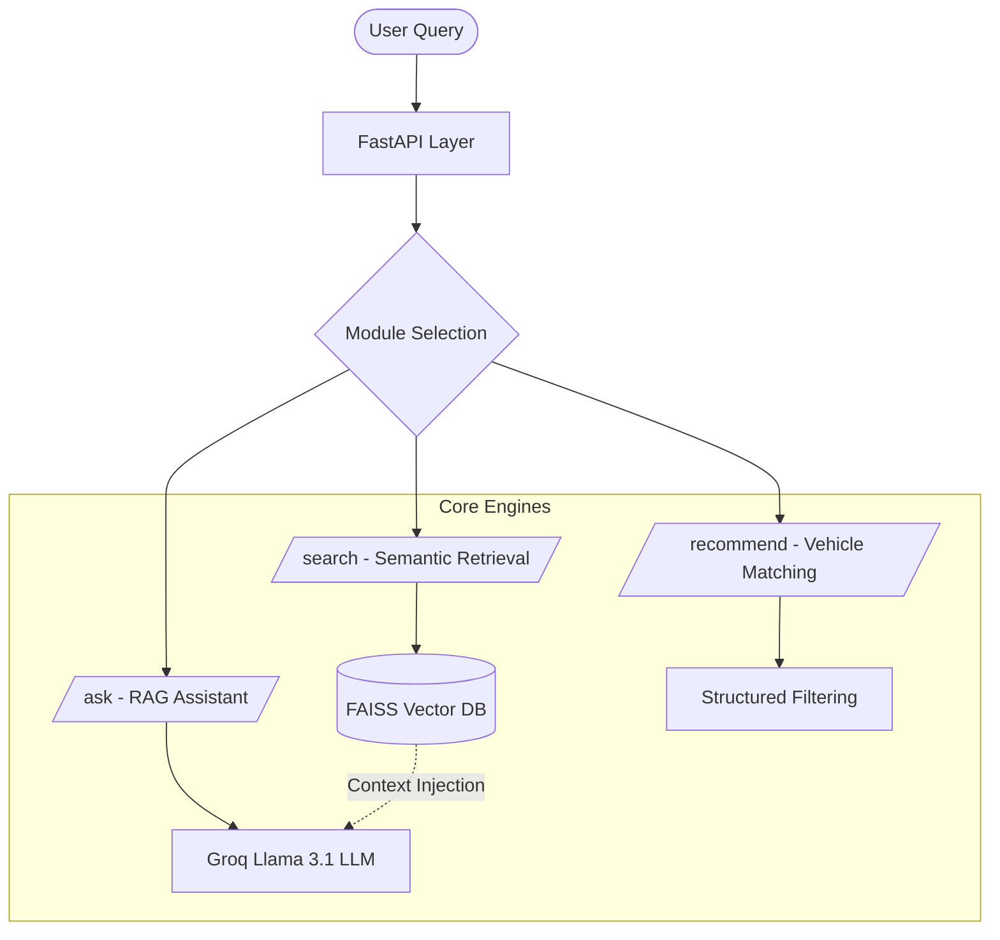

# Ford Vehicle Intelligence System
### AI-Powered Automotive Knowledge Assistant

An advanced, RAG-based (Retrieval-Augmented Generation) assistant designed for vehicle-related queries. Built as part of a technical assessment for the AI Engineer role, this system provides grounded, safety-focused answers about Ford vehicles.

---

## Key Features

- **Semantic Search**: Context-aware retrieval using FAISS and Sentence-Transformers.
- **RAG Architecture**: Grounded LLM responses using Groq Llama 3.1 (8B).
- **Smart Recommender**: Attribute-based vehicle matching with explainable reasoning.
- **Dynamic Dashboard**: High-end React/Vite Single Page Application (SPA) with a corporate aesthetic.
- **Safety First**: Strict grounding to manual data to prevent harmful hallucinations.
- **Containerized**: Easy deployment with Docker.

---

## Tech Stack

| Component | Technology |
| :--- | :--- |
| **Language** | Python 3.10+ |
| **API Framework** | FastAPI |
| **Frontend** | React, Vite, Tailwind/Vanilla CSS, Framer Motion |
| **Vector Database** | FAISS (Facebook AI Similarity Search) |
| **Embeddings** | Sentence-Transformers (`all-MiniLM-L6-v2`) |
| **LLM** | Groq Llama 3.1 (8B) |
| **DevOps** | Docker |

---

## Getting Started

### 1. Installation
```bash
# Clone the repository
git clone <repo-url>
cd automotive-ai-rag-assistant

# Install dependencies
pip install -r requirements.txt
```

### 2. Configuration
Create a `.env` file in the root directory:
```env
GROQ_API_KEY=your_groq_api_key_here
```

### 3. Running the API
```bash
# Start the server
uvicorn app.main:app --reload
```
Open [http://localhost:8000/docs](http://localhost:8000/docs) to explore the API.
## Setup & Run

```bash
# Upgrade pip
pip install --upgrade pip

# Install dependencies
pip install -r requirements.txt

# Install compatible PyTorch & Transformers
pip install torch==2.2.0 transformers==4.41.0

# Verify installations
python -c "import torch, transformers; print('torch', torch.__version__); print('transformers', transformers.__version__)"

# Run the backend API
uvicorn app.main:app --reload
```

Visit <http://localhost:8000/docs> to explore the API.

### 4. Running the Frontend Dashboard
Open a new terminal and run:
```bash
cd frontend
npm install
npm run dev
```

Visit <http://localhost:5173> to interact with the Ford Intelligence System.

---

## System Architecture

The system follows a modular pipeline designed for accuracy and safety:



---

## Core AI Concepts

### 1. Semantic Search & FAISS
Instead of simple keyword matching, we use **Embeddings** to represent the "meaning" of text.
- **Model**: `all-MiniLM-L6-v2` (384-dimensional space).
- **Similarity Metric**: **Cosine Similarity**. We normalize our vectors to Unit Length and use Inner Product (`IndexFlatIP`) to find the nearest neighbors in the semantic space.
- **Chunking Strategy**: We split manual text into smaller chunks (100–300 words) to ensure semantic relevance and improve retrieval accuracy.

### 2. Retrieval-Augmented Generation (RAG)
**What is RAG?**
Retrieval-Augmented Generation (RAG) is a technique that combines information retrieval with a text-generating LLM. Instead of relying solely on the LLM's internal weights (which might contain outdated or mixed knowledge), RAG fetches specific, relevant documents from a trusted knowledge base and feeds them into the LLM as context to generate an answer.

The system:
1.  **Retrieves** the top-3 most relevant chunks using cosine similarity from Ford manuals.
2.  **Augments** the LLM prompt via **Context Injection**, building a structured prompt that contains both the user query and the retrieved text.
3.  **Generates** an answer that is strictly anchored to the provided data.

**Prompt Template**
The core instructions passed to the LLM are:
```text
You are a professional Ford Automotive Assistant. Your goal is to provide accurate, grounded, and helpful information to vehicle owners.
CONTEXT INFORMATION: {context_text}
USER QUESTION: {question}
STRICT INSTRUCTIONS:
1. Use ONLY the provided context to answer the question.
2. If the answer is not in the context, state that you don't have that specific information and suggest contacting a Ford dealership.
3. Do NOT hallucinate features, specs, or service intervals not mentioned in the context.
4. Keep the tone professional and safety-focused.
5. If the question is about a safety warning, prioritize clear instructions.
```

### 3. Hallucination Mitigation & Grounding
**Why grounding is important in the automotive domain?**
Vehicles are heavy machinery. Incorrect advice about tire pressure, towing capacity, fluid types, or safety warnings can lead to severe mechanical damage, warranty voidance, or physical harm. Grounding ensures the LLM acts only as a reasoning engine over verified, official service data.

**What causes hallucination in vehicle advice?**
Base LLMs are trained on billions of parameters across the entire internet. When asked about a specific vehicle (e.g., "2023 Ford Ranger oil capacity"), the LLM might hallucinate by:
- Confusing specs across different trims, engine types, or model years (e.g., suggesting V8 specs for an EcoBoost V6).
- Extrapolating capabilities from competitors (e.g., blending Ford and Chevy statistics).
- Making logical but technically incorrect guesses when it doesn't actually "know" the fact.

**Mitigation Strategy:**
- **Strict Grounding Prompt**: Explicitly ordering the LLM to output "I don't know" if the context lacks the answer.
- **Top-K Retrieval**: Only passing highly relevant context to prevent the LLM from getting distracted by unrelated manuals.

### 4. Recommendation Logic
Recommendation is based on rule-based filtering using attributes like vehicle type, seating capacity, and usage intent.

### 5. Production-Ready Safeguards
- **Input Sanitization**: Input queries are validated and sanitized to handle empty, whitespace, and malformed inputs gracefully using Pydantic validation and regex filtering.
- **Fail-Safe Design**: The system is designed to fail safely — returning no results or a fallback response instead of producing incorrect or hallucinated outputs.
- **Future Improvement (Rate Limiting)**: Add rate limiting to prevent abuse and ensure API stability.

---

## API Reference

| Endpoint | Method | Description |
| :--- | :--- | :--- |
| `/search` | `POST` | Semantic search across manuals and specifications. |
| `/ask` | `POST` | RAG-based AI assistant for grounded answers. |
| `/recommend` | `POST` | Logical vehicle recommendations based on user needs. |

### Sample API Request

**`POST /ask`**
```json
{
  "question": "What does engine warning light mean?"
}
```

---

## Project Structure

```text
├── app/
│   ├── core/           # Logic (Embeddings, RAG, Recommender)
│   ├── data/           # Synthetic Datasets (JSON)
│   ├── main.py         # FastAPI Entry Point
│   └── models.py       # Pydantic Schemas
├── frontend/           # React/Vite Dashboard SPA
├── tests/              # Verification Scripts
├── Dockerfile          # Container Configuration
└── requirements.txt    # Project Dependencies
```