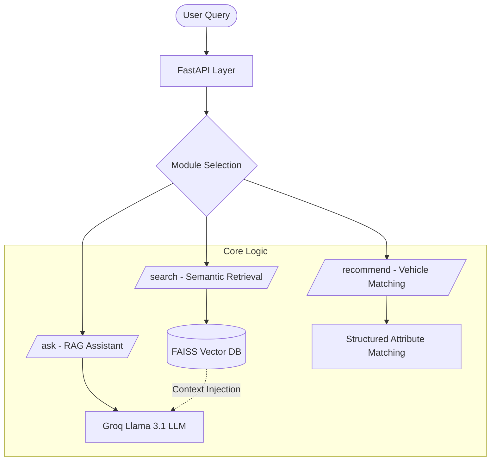

# Ford Vehicle Intelligence System
## AI-Powered Automotive Knowledge Assistant

A specialized RAG-based (Retrieval-Augmented Generation) assistant designed to handle Ford vehicle-related queries. This project implements semantic search, grounded AI responses, and logic-based vehicle recommendations .

---

## Key Features

*   **Semantic Search**: High-performance retrieval using **FAISS** and **Sentence-Transformers**.
*   **RAG Architecture**: Grounded, hallucination-resistant answers powered by **Groq (Llama 3.1 8B)**.
*   **Logic-Based Recommender**: Intelligent vehicle matching based on usage intent and structured attributes.
*   **Safety Critical**: Strict grounding to official manual data to ensure technical accuracy and user safety.
*   **Containerized**: Fully Dockerized for seamless deployment.

---

## Tech Stack

| Component | Technology |
| :--- | :--- |
| **Backend** | Python 3.10+, FastAPI |
| **Vector DB** | FAISS (IndexFlatIP) |
| **Embeddings** | Sentence-Transformers (`all-MiniLM-L6-v2`) |
| **LLM** | Groq Llama 3.1 (8B) |
| **Deployment** | Docker, Uvicorn |

---

## 📦 Project Structure

```text
├── app/
│   ├── core/           # Business Logic
│   │   ├── embeddings.py  # FAISS & Semantic Search Engine
│   │   ├── rag.py         # RAG & LLM Integration
│   │   └── recommender.py # Vehicle Recommendation Logic
│   ├── data/           # Synthetic Datasets (JSON)
│   ├── main.py         # FastAPI Entry Point & Routes
│   └── models.py       # Pydantic Schemas (Input/Output)
├── tests/              # API Testing Suite
├── Dockerfile          # Container Configuration
└── requirements.txt    # Project Dependencies
```

---

## ⚙️ Setup & Installation

### 1. Prerequisites
*   Python 3.10 or higher
*   [Groq API Key](https://console.groq.com/)

### 2. Local Setup
```bash
# Clone the repository
git clone <repo-url>
cd automotive-ai-rag-assistant

# Create and activate virtual environment
python -m venv .venv
source .venv/bin/activate  # Windows: .venv\Scripts\activate

# Install dependencies
pip install -r requirements.txt
```

### 3. Environment Configuration
Create a `.env` file in the root directory:
```env
GROQ_API_KEY=your_groq_api_key_here
```

### 4. Run the API
```bash
uvicorn app.main:app --reload
```
The API will be available at `http://localhost:8000`. Explore the interactive documentation at `http://localhost:8000/docs`.

---

## 🐳 Docker Deployment

To run the application in a containerized environment:

```bash
# Build the image
docker build -t ford-ai-assistant .

# Run the container
docker run -p 8000:8000 --env-file .env ford-ai-assistant
```

---

## 🏗️ Architecture Explanation

The system is built on a modular pipeline designed for precision and safety.

### 1. Semantic Search & Embeddings
Instead of keyword matching, we use **Dense Vector Embeddings** to understand the intent behind a query.
*   **Embeddings**: We use `all-MiniLM-L6-v2` to map text to a 384-dimensional space.
*   **Similarity Metric**: **Cosine Similarity**. We use `faiss.normalize_L2` and `IndexFlatIP`. This measures the cosine of the angle between vectors, ensuring that semantically similar concepts (e.g., "how to fix" and "repair instructions") are ranked higher.

### 2. Retrieval-Augmented Generation (RAG)
**What is RAG?**
RAG is a technique that provides an LLM with external, verified context (the "Retrieved" data) to "Augment" its knowledge before "Generating" a response.

**Why Grounding is Important?**
In the automotive domain, incorrect advice (e.g., wrong oil type or misunderstood brake warning) can lead to vehicle damage or safety risks. **Grounding** ensures the LLM acts only as a reasoning layer over official Ford data, rather than relying on generalized training data.

**Hallucination Mitigation:**
*   **Context Injection**: The prompt includes retrieved snippets from manuals and specs.
*   **Strict Constraints**: The LLM is explicitly forbidden from using prior knowledge to fill gaps. If the answer isn't in the context, it must say "I don't know."
*   **Low Temperature**: Set to `0.1` to ensure deterministic and focused output.

### 3. Recommendation Logic
The recommendation module uses **Attribute Matching**. It maps user intents (e.g., "towing", "family") to specific vehicle capabilities like `seats` and `towing_capacity`, providing top-2 suggestions with explainable reasoning.

---

## 📊 Architecture Diagram



---

## 🧪 API Endpoints

| Endpoint | Method | Description |
| :--- | :--- | :--- |
| `/search` | `POST` | Semantic search across manuals and specifications. |
| `/ask` | `POST` | AI-powered grounded responses using RAG. |
| `/recommend` | `POST` | Intelligent vehicle suggestions based on user needs. |

**Sample Request (`/ask`):**
```json
{
  "question": "Service interval for Ford Ranger 2023?"
}
```

---

## 💡 Design Decisions

1.  **FAISS CPU over GPU**: Chosen for lightweight deployment and because the vector count (<1000) doesn't require GPU acceleration.
2.  **Llama 3.1 (8B) via Groq**: Provides exceptionally low latency (sub-second) while maintaining high reasoning quality for technical extraction.
3.  **JSON over SQLite**: Given the static nature of the assessment dataset, JSON files offer maximum transparency and simplicity for reviewers.
4.  **Pydantic V2**: Utilized for robust input validation and auto-generated OpenAPI documentation.
