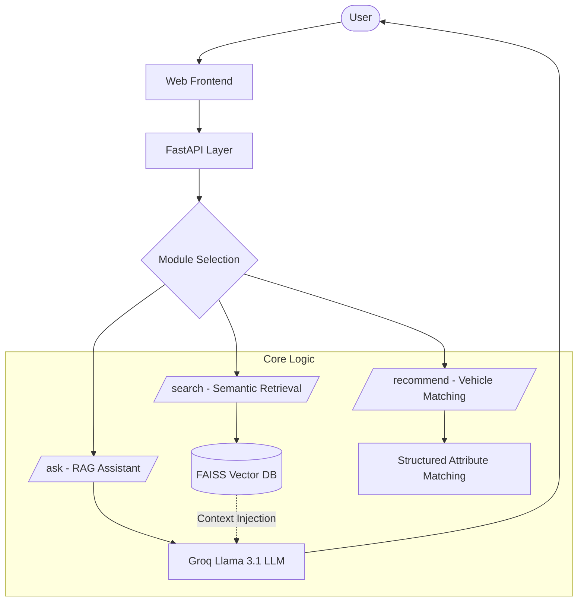

# Ford Vehicle Intelligence System
## AI-Powered Automotive Knowledge Assistant

A specialized RAG-based (Retrieval-Augmented Generation) assistant designed to handle Ford vehicle-related queries. This project implements semantic search, grounded AI responses, and logic-based vehicle recommendations as part of a technical assessment for the AI Engineer role.

---

## Key Features

- **Semantic Search**: High-performance retrieval using **FAISS** and **Sentence-Transformers**.
- **RAG Architecture**: Grounded, hallucination-resistant answers powered by **Groq (Llama 3.1 8B)**.
- **Logic-Based Recommender**: Intelligent vehicle matching based on usage intent and structured attributes.
- **Safety Critical**: Strict grounding to official manual data to ensure technical accuracy and user safety.
- **Containerized**: Fully Dockerized for seamless deployment.

---

## Tech Stack

| Component | Technology |
| :--- | :--- |
| **Backend** | Python 3.10+, FastAPI |
| **Frontend** | Vanilla JS, CSS3, HTML5 (Served via FastAPI) |
| **Vector DB** | FAISS (IndexFlatIP) |
| **Embeddings** | Sentence-Transformers (`all-MiniLM-L6-v2`) |
| **LLM** | Groq Llama 3.1 (8B) |
| **Deployment** | Docker, Uvicorn |

---

## Project Structure

```text
├── app/
│   ├── core/           # Business Logic
│   │   ├── embeddings.py  # FAISS & Semantic Search Engine
│   │   ├── rag.py         # RAG & LLM Integration
│   │   └── recommender.py # Vehicle Recommendation Logic
│   ├── main.py         # FastAPI Entry Point & Routes
│   └── models.py       # Pydantic Schemas (Input/Output)
├── frontend/           # Modern UI Assets
│   ├── index.html      # Main Application View
│   ├── style.css       # Premium Design & Animations
│   └── script.js       # API Integration Logic
├── data/               # Synthetic Datasets (JSON)
├── tests/              # API Testing Suite
├── Dockerfile          # Container Configuration
├── requirements.txt    # Project Dependencies
└── .env                # Environment Variables (Local)
```

---

## Setup & Installation

### 1. Prerequisites
- Python 3.10 or higher
- [Groq API Key](https://console.groq.com/)

### 2. Local Setup
```bash
# Clone the repository
git clone <repo-url>
cd automotive-ai-rag-assistant

# Create and activate virtual environment
python -m venv .venv
source .venv/bin/activate  # Windows: .venv\Scripts\activate

# Install dependencies
pip install -r requirements.txt
```

### 3. Environment Configuration
Create a `.env` file in the root directory:
```env
GROQ_API_KEY=your_groq_api_key_here
```

### 4. Run the API
```bash
uvicorn app.main:app --reload
```
The application will be available at:
- **UI**: `http://localhost:8000/`
- **Docs**: `http://localhost:8000/docs`
- **Health**: `http://localhost:8000/api/health`

---

## Docker Deployment

To run the application in a containerized environment:

```bash
# Build the image
docker build -t ford-ai-assistant .

# Run the container (ensure .env exists with GROQ_API_KEY)
docker run -p 8000:8000 --env-file .env ford-ai-assistant
```

---

## Architecture & Technical Deep-Dive

This system is designed as a production-ready **RAG (Retrieval-Augmented Generation)** pipeline. Here is the technical breakdown:

### 1. What is RAG?
**Retrieval-Augmented Generation** combines a high-performance search engine with a Large Language Model (LLM). Instead of the LLM guessing based on its training data, we provide it with real, verified documentation (retrieved in real-time) to ensure answers are strictly **grounded** in truth.

### 2. Why Grounding Matters?
In the **automotive industry**, technical accuracy is not optional—it is a safety requirement. Hallucinated service intervals, torque specs, or dashboard warning definitions can lead to vehicle damage, warranty voidance, or even physical safety risks for the driver.

### 3. User Query Pipeline (Architecture Flow)
The system follows a linear, high-integrity pipeline:
1.  **User Query**: The user asks a question (e.g., "Towing capacity of Ranger?").
2.  **Embedding**: We use **sentence-transformers** (`all-MiniLM-L6-v2`) to convert the query into a dense 384-dimensional vector.
3.  **Vector Search (FAISS)**: We perform a semantic search against our database.
4.  **Ranking (Cosine Similarity)**: Results are ranked using the **Cosine Similarity** formula. We ensure this by L2-normalizing vectors and using an Inner Product search (`IndexFlatIP`).
5.  **Context Injection**: The Top-3 most relevant chunks are injected into the LLM prompt.
6.  **Grounded Response**: The LLM (Llama 3.1) synthesizes a final answer using **only** the provided context.

### 4. Chunking & Search Logic
- **Chunking Logic**: Manuals are not stored as giant files. They are split into **100–300 word blocks** to ensure high semantic granularity and context relevance during retrieval.
- **Intent Detection**: The system handles casual inputs (e.g., "Hello") through a dedicated intent layer, preventing unnecessary retrieval and ensuring a clean UX.

### 5. Hallucination Mitigation (Fail-Safe Design)
We implement a multi-layered defense against AI "hallucinations":
- **Strict Prompting**: The LLM is explicitly instructed to answer using **ONLY** the provided context.
- **Fail-Safe Response**: If the answer is not in the documentation, the system must say "I don't know" rather than guessing.
- **Low Temperature**: Set to `0.1` to maximize deterministic output and minimize creative "drift".

### 6. Scoring: Match Relevance
The score shown as "Match Relevance" is the raw **Cosine Similarity** score (0.0 to 1.0). This represents the mathematical confidence that the retrieved document block matches the user's semantic intent.This metric represents the semantic closeness of the user's intent to the stored documentation.

### 3. Recommendation Logic
The recommendation module uses **Attribute Matching**. It maps user intents (e.g., "towing", "family") to specific vehicle capabilities like `seats` and `towing_capacity`, providing top-2 suggestions with explainable reasoning.

---

## Architecture Diagram



---

## API Endpoints

| Endpoint | Method | Description |
| :--- | :--- | :--- |
| `/search` | `POST` | Semantic search across manuals and specifications. |
| `/ask` | `POST` | AI-powered grounded responses using RAG. |
| `/recommend` | `POST` | Intelligent vehicle suggestions based on user needs. |

**Sample Request (`/ask`):**
```json
{
  "question": "Service interval for Ford Ranger 2023?"
}
```

---

## Design Decisions

1. **FAISS CPU over GPU**: Chosen for lightweight deployment and because the vector count (<1000) doesn't require GPU acceleration.
2. **Llama 3.1 (8B) via Groq**: Provides exceptionally low latency (sub-second) while maintaining high reasoning quality for technical extraction.
3. **JSON over SQLite**: Given the static nature of the assessment dataset, JSON files offer maximum transparency and simplicity for reviewers.
4. **Pydantic V2**: Utilized for robust input validation and auto-generated OpenAPI documentation.
